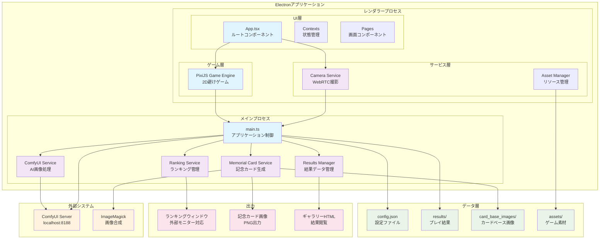

# KidsPG避けまくり中ゲーム

## 概要

『KidsPG避けまくり中ゲーム』は、Electron、React、PixiJSをベースに開発された、オフラインイベント向けのインタラクティブな2Dゲームアプリケーションです。プレイヤーはカメラで顔写真を撮影し、AIで加工されたユニークなキャラクターでゲームをプレイできます。

## 主な機能

-   **カメラ撮影**: WebRTCを利用してプレイヤーの顔写真を撮影します。
-   **AI画像加工**: ローカルで動作するComfyUIと連携し、撮影した写真をAIでユニークな画像に変換します。
-   **2D避けゲー**: PixiJSによる軽快な2Dゲームエンジンで、3レーンのシンプルな避けゲームを楽しめます。
-   **スコアとランキング**: プレイ結果はローカルに保存され、リアルタイムでランキングが表示されます。外部モニターにも対応しています。
-   **記念カード生成**: ゲーム終了後、スコアやレベル、ユニークな二つ名が入った記念カードが自動生成されます。

## 技術スタック

本プロジェクトは、以下の主要技術で構成されています。

| 区分 | 技術 |
| :--- | :--- |
| **デスクトップアプリ** | Electron, React, TypeScript, TailwindCSS |
| **ゲームエンジン** | PixiJS |
| **画像処理** | WebRTC, ComfyUI API, Canvas API |
| **データ管理・自動化** | Node.js, ImageMagick |

詳細な技術選定やシステム構成については、[docs/tech_stack.md](docs/tech_stack.md) をご参照ください。

## システム構成図



### システム動作フロー

1. **ゲーム開始**: プレイヤーがカメラで顔写真を撮影
2. **画像処理**: ComfyUIサービスがAI画像変換を実行（バックグラウンド）
3. **ゲームプレイ**: PixiJSエンジンで3レーンの避けゲームを実行
4. **結果保存**: ゲーム結果をJSONファイルとして保存
5. **記念カード生成**: ImageMagickで記念カードを自動生成
6. **ランキング更新**: リアルタイムでランキング表示を更新

### 特徴

- **完全オフライン動作**: インターネット接続不要
- **リアルタイム処理**: AI処理とゲームプレイの並行実行
- **イベント特化設計**: 外部モニター対応、連続プレイ最適化
- **柔軟な設定**: config.jsonによる詳細なパラメータ調整
- **プライバシー保護**: 全データがローカル処理で完結

## 前提条件

このアプリケーションを全ての機能を含めて利用するには、以下のソフトウェアがローカル環境にインストールされている必要があります。

### 必須要件
-   **Node.js** (~22.x) - アプリケーション実行環境
-   **ImageMagick** - 記念カード画像合成用

### オプション要件（フル機能利用時）
-   **Python** (~3.13) - ComfyUI実行用
-   **ComfyUI** - AI画像加工用（localhost:8188で起動）
-   **Webカメラ** - プレイヤー写真撮影用

## 開発

### 環境構築

1.  リポジトリをクローンします。
2.  依存パッケージをインストールします。
    ```bash
    npm install
    ```

### 開発モードでの実行

```bash
npm run electron:dev
```

このコマンドで開発モードを開始できます。ホットリロードが有効になり、ファイルの変更が自動で反映されます。

その他の実行・ビルドコマンドについては、[アプリケーションの実行とビルド](#アプリケーションの実行とビルド)セクションを参照してください。

### コードスタイル

このプロジェクトのコードスタイルは、**Prettier**（フォーマッター）と**ESLint**（リンター）によって管理されています。開発に参加する際は、以下のコマンドを利用してコードの品質を維持してください。

```bash
# Lintエラーのチェック
npm run lint

# Lintエラーのチェックと自動修正
npm run lint:fix

# コードの自動整形
npm run format
```

## アプリケーションの実行とビルド

本番用のアプリケーションをビルド、実行、パッケージ化するためのコマンドです。

### 主要コマンド
-   **`npm start`**: 本番用ビルド→実行の一括コマンド（推奨）
-   **`npm run build`**: 本番用にアプリケーションをビルドし、`dist`ディレクトリに出力
-   **`npm run electron`**: ビルド済みのアプリケーションを起動
-   **`npm run dist`**: 配布用パッケージを`release`フォルダに作成

### 開発・保守コマンド
-   **`npm run recovery`**: 記念カード復元ツール（results内の画像を修復）
-   **`npm run recovery:dry`**: 復元のドライラン実行（実際の修正は行わない）
-   **`npm run recovery:reset`**: 復元設定をリセット
-   **`npm run recovery:force`**: 全記念カードを強制再生成

### 通常実行

```bash
npm start
```

### 配布パッケージのビルド

```bash
npm run dist
```

特定のプラットフォーム向けにビルドすることも可能です。

-   **Windows**: `npm run dist:win`
-   **macOS**: `npm run dist:mac`
-   **Linux**: `npm run dist:linux`

## 設定とカスタマイズ

### config.json設定ファイル

アプリケーションの動作は`config.json`で詳細にカスタマイズできます：

```json
{
  "game": {
    "obstacle": {
      "speed": { "min": 2.0, "max": 50.0, "incrementPerLevel": 0.6 },
      "spawnDistance": { "min": 200, "max": 500, "decrementPerLevel": 20 }
    },
    "levelUpScoreInterval": 50,
    "targetFPS": 60
  },
  "comfyui": {
    "baseUrl": "http://127.0.0.1:8188",
    "timeouts": { "processing": 600000 }
  },
  "memorialCard": {
    "enabled": true,
    "magickTimeout": 60000
  },
  "ranking": {
    "pagination": { "cardsPerPage": 5, "intervalSeconds": 8 }
  }
}
```

### ディレクトリ構造

```
├── src/
│   ├── main/                 # Electronメインプロセス
│   │   ├── main.ts          # アプリケーションエントリポイント
│   │   └── services/        # バックエンドサービス群
│   ├── renderer/            # Reactフロントエンド
│   │   ├── App.tsx         # UIルートコンポーネント
│   │   ├── contexts/       # 状態管理
│   │   ├── pages/          # 画面コンポーネント
│   │   ├── game/           # PixiJSゲームエンジン
│   │   └── assets/         # ゲーム素材
│   └── shared/             # 共通型定義・ユーティリティ
├── results/                # プレイ結果保存先
├── card_base_images/       # 記念カード背景画像
├── config.json            # アプリケーション設定
└── dist/                  # ビルド出力先
```

## トラブルシューティング

### よくある問題

1. **ComfyUIに接続できない**
   - ComfyUIサーバーが localhost:8188 で起動しているか確認
   - `config.json` の `comfyui.baseUrl` 設定を確認

2. **記念カードが生成されない**
   - ImageMagickがインストールされているか確認
   - `card_base_images/` に背景画像が存在するか確認

3. **カメラが認識されない**
   - Webカメラのドライバが正しくインストールされているか確認
   - ブラウザでカメラアクセス許可が与えられているか確認

### デバッグ情報

開発モードでは、F12でデベロッパーツールが開き、詳細なログが確認できます。

## ライセンス

このプロジェクトは [MIT License](LICENSE) の下で公開されています。

## 作者

**KidsPG Team** (`info@kidspg.com`)