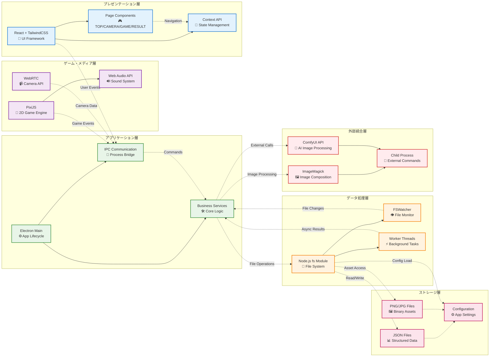

### 設計方針

要件定義書（main_plan_v0.2.md）に基づき、以下の技術アーキテクチャで実装しています：

1.  **Electronアプリケーション**: スタンドアロン実行可能な統合アプリケーション
2.  **ComfyUIローカル連携**: AI画像加工のためのセルフホストAPI
3.  **リアルタイムランキング**: Electron内蔵のランキング表示システム

オフライン完結型のイベント向けアプリケーションとして設計し、外部サーバーへの依存を最小限に抑えています。

---

### 技術スタック詳細

| 区分 | コンポーネント | 選定技術 | 選定理由 |
| :--- | :--- | :--- | :--- |
| **デスクトップアプリ** | **アプリケーション基盤** | **Electron** | クロスプラットフォーム対応、ローカルファイルシステムへの完全アクセス、WebRTCカメラ機能、外部ウィンドウ表示機能を統合的に提供 |
| | **UIフレームワーク** | **React + TypeScript** | コンポーネントベースの保守性、型安全性、豊富なエコシステム。Electronとの統合実績が豊富 |
| | **スタイリング** | **TailwindCSS** | ユーティリティファーストでレスポンシブ対応、プロトタイプから本格運用まで一貫した開発体験 |
| | **ゲームエンジン** | **PixiJS** | 軽量で高速な2Dレンダリング。3レーン移動ゲームに最適、Electronとの親和性良好 |
| **画像処理** | **カメラ撮影** | **WebRTC MediaDevices API** | ブラウザ標準API、500×500px正方形リサイズ機能をCanvas APIと組み合わせて実現 |
| | **AI画像加工** | **ComfyUI API** | セルフホスト可能、ワークフロー指向で柔軟な画像生成、ローカル実行でプライバシー保護 |
| | **記念カード生成** | **ImageMagick** | スコア・レベル・二つ名情報をベース画像と合成してPNG出力 |
| **データ管理** | **ファイル出力** | **Node.js fs モジュール** | JSON形式でのプレイ結果保存、画像ファイル管理、Electronの特権プロセスで実行 |
| | **ランキング管理** | **RankingService** | results.jsonをリアルタイム監視、ランキングデータを自動更新 |
| **表示・公開** | **ランキング表示** | **Electron BrowserWindow** | 外部モニター対応の別ウィンドウでランキングをリアルタイム表示 |
| | **ギャラリー生成** | **HTMLテンプレート** | プレイ結果の画像ギャラリーを静的HTMLとして自動生成 |

---

### バージョン依存関係

以下のバージョンを推奨します。これらは2025年8月時点での安定性と互換性を考慮して選定しています。

| 区分 | 技術 | 推奨バージョン | 備考 |
| :--- | :--- | :--- | :--- |
| **共通** | **Node.js** | `~22.x` (LTS) | Electron実行環境の基盤 |
| | **Python** | `~3.13` | ComfyUI実行環境 |
| **Electronアプリ** | **Electron** | `^33.0.0` | デスクトップアプリケーション基盤 |
| | **React** | `^18.3.0` | UIフレームワーク（Electron安定版対応） |
| | **TypeScript** | `^5.6.0` | 静的型付け |
| | **TailwindCSS** | `^3.4.0` | CSSフレームワーク |
| | **PixiJS** | `^8.4.0` | 2Dゲームエンジン |
| **AI画像処理** | **ComfyUI** | `latest` | セルフホストAI画像生成 |
| | **ImageMagick** | `7.x` | 記念カード画像合成 |
| **開発支援** | **Vite** | `^6.0.0` | 高速ビルドツール（Electron統合） |
| | **ESLint** | `^8.57.0` | コード品質保持 |
| | **Prettier** | `^3.3.0` | コードフォーマッター |
| | **concurrently** | `^8.2.0` | 複数のnpmスクリプトを並行実行 |
| | **wait-on** | `^8.0.0` | プロセスの実行順序を制御 |
| | **electron-builder** | `^26.0.12` | 配布用パッケージを作成 |

**補足: バージョン表記について**
- `^` (キャレット): `package.json`で一般的に使用され、メジャーバージョンが同じ範囲での最新版への更新を許容します (例: `^1.2.3` は `1.x.x` の最新版に更新)。
- `~` (チルダ): マイナーバージョンが同じ範囲でのパッチ更新のみを許容します (例: `~1.2.3` は `1.2.x` の最新版に更新)。
このドキュメントでは、`package.json`との整合性を重視し `^` を基本としますが、環境要因などで厳密なバージョン管理が求められる場合は `~` や固定バージョンを使用します。

---

### 技術層別アーキテクチャ

### 主要な実装特徴

- **マルチプロセス設計**: Electronメイン/レンダラープロセス分離による安定性
- **リアルタイム処理**: ComfyUIとゲームプレイの非同期並行実行
- **ファイル監視システム**: FSWatcherによるランキング自動更新
- **スケーラブル設定**: config.jsonによる詳細パラメータ制御
- **復元機能**: 記念カード生成の失敗回復とバッチ処理
- **レスポンシブ対応**: 動的画面サイズ調整とマルチモニター対応
